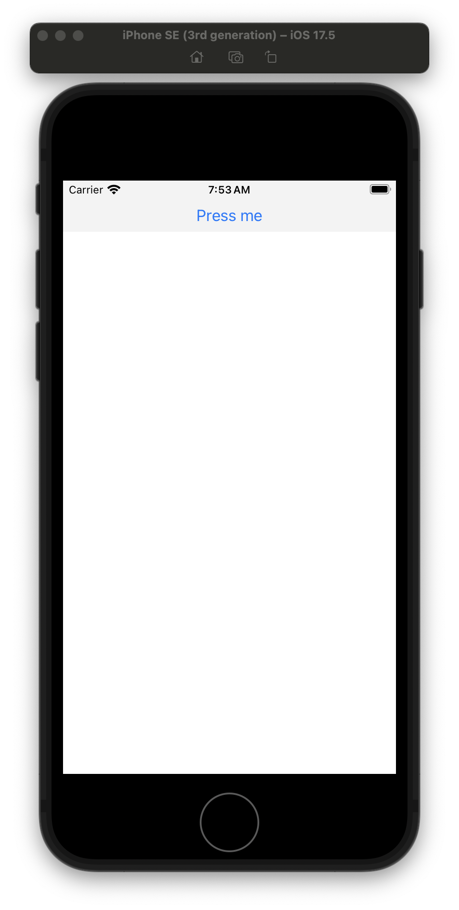
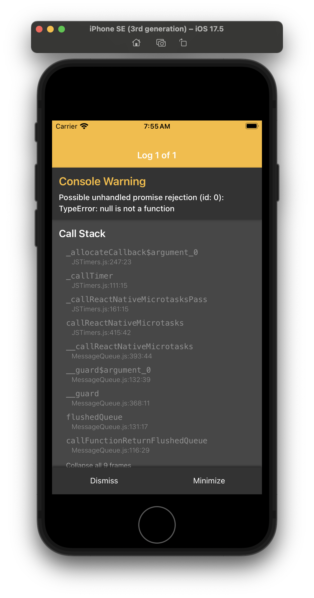

# react-native-type-error-null-is-not-a-function

Reproduction for "TypeError: null is not a function" when null is passed to finally block.

## How to reproduce

```console
$ corepack enable

$ cd ReproducerApp

$ yarn

$ yarn ios
```

### Observed behavior

The app will show the button "Press me" as follows

  <details><summary>Default load "Press Me" button</summary>
  <p>



  </p>
  </details>

On pressing the button, the Console Warning will be shown for possible unhandled promise rejection as follows

  <details><summary>Console Warning</summary>
  <p>



  </p>
  </details>
